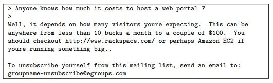
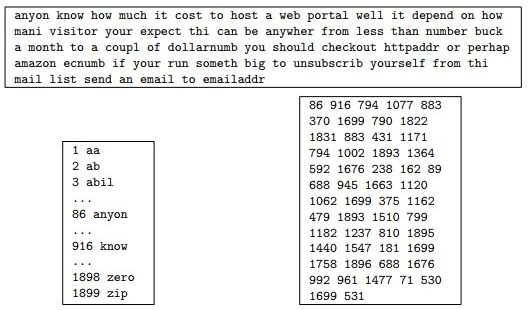

# spam-classification-svm
Spam Classification System using SVM

Many email services today provide spam filters that are able to classify emails into spam and non-spam email with high accuracy. In this project, I have used support vector machines (SVMs) to build a spam filter. We will be training a classifier to classify whether a given email, x, is spam (y = 1) or non-spam (y = 0). In particular, we need to convert each email into a feature vector x (n-dimensional). The dataset included for this project is based on a a subset of the SpamAssassin Public Corpus. For the purpose of this project, we will only be using the body of the email (excluding the email headers).

**Preprocessing Emails**

Before starting on a machine learning task, it is usually insightful to take a look at examples from the dataset. Above figure shows a sample email that contains a URL, an email address (at the end), numbers, and dollar amounts. While many emails would contain similar types of entities (e.g., numbers, other URLs, or other email addresses), the specific entities (e.g., the specific URL or specific dollar amount) will be different in almost every email. Therefore, one method often employed in processing emails is to "normalize" these values, so that all URLs are treated the same, all numbers are treated the same, etc. For example, we could replace each URL in the email with the unique string "httpaddr" to indicate that a URL was present.

This has the effect of letting the spam classifier make a classification decision based on whether any URL was present, rather than whether a specific URL was present. This typically improves the performance of a spam classifier, since spammers often randomize the URLs, and thus the odds of seeing any particular URL again in a new piece of spam is very small. In processEmail.m, we have implemented the following email preprocessing and normalization steps:

- Lower-casing: The entire email is converted into lower case, so that captialization is ignored (e.g., IndIcaTE is treated the same as
Indicate).
- Stripping HTML: All HTML tags are removed from the emails. Many emails often come with HTML formatting; we remove all the HTML tags, so that only the content remains.
- Normalizing URLs: All URLs are replaced with the text "httpaddr".
- Normalizing Email Addresses: All email addresses are replaced with the text "emailaddr".
- Normalizing Numbers: All numbers are replaced with the text "number".
- Normalizing Dollars: All dollar signs ($) are replaced with the text "dollar".
- Word Stemming: Words are reduced to their stemmed form. For example, "discount", "discounts", "discounted" and "discounting" are all replaced with "discount". Sometimes, the Stemmer actually strips off additional characters from the end, so "include", "includes", "included", and "including" are all replaced with "includ".
- Removal of non-words: Non-words and punctuation have been removed. All white spaces (tabs, newlines, spaces) have all been trimmed to a single space character.

**Vocabulary List**

After preprocessing the emails, we have a list of words for each email. The next step is to choose which words we would like to use in
our classifier and which we would want to leave out.

For this project, we have chosen only the most frequently occuring words as our set of words considered (the vocabulary list). Since words that occur rarely in the training set are only in a few emails, they might cause the model to overfit our training set. The complete vocabulary list is in the file vocab.txt. Our vocabulary list was selected by choosing all words which occur at least a 100 times in the spam corpus, resulting in a list of 1899 words. In practice, a vocabulary list with about 10,000 to 50,000 words is often used.

Given the vocabulary list, we can now map each word in the preprocessed emails into a list of word indices that contains the index of the word in the vocabulary list. The mapping for the sample email is showed in the figure. Specifically, in the sample email, the word "anyone" was first normalized to "anyon" and then mapped onto the index 86 in the vocabulary list.

**Extracting Features from Emails**

We will now implement the feature extraction that converts each email into a n-dimensional vector. For this project, we will be using n = # words in vocabulary list. Specifically, the feature x*i* = 0 or 1 for an email corresponds to whether the i-th word in the dictionary occurs in the email. That is, x*i* = 1 if the i-th word is in the email and x*i* = 0 if the i-th word is not present in the email.

**Training SVM for Spam Classification**

spamTrain.mat contains 4000 preprocessed training examples of spam and non-spam email which will be used to train a SVM classifier, while spamTest.mat contains 1000 test examples. Each original email was processed using the processEmail and emailFeatures functions and converted into a 1899-dimensional vector x*i*.
